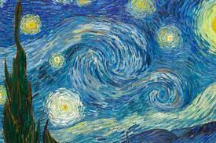

% Introducción a la historia del arte
% Celia Almenara Moral
% mayo de 2023

# Introducción

## ¿Qué vamos a ver durante el curso?

 - ¿Qué es el arte?
 - Diferentes épocas del arte.
 - Prácticas

\centering

{ width=30% }\

# Historia del arte en pocas palabras

## Definiciones

* La **historia del arte** es el relato de la evolución del arte a través del tiempo, entendido como cualquier actividad o producto realizado por el ser humano con **finalidad estética o comunicativa**, a través de la cual se expresan ideas, emociones o, en general, una visión del mundo, empleando diversos recursos, como los plásticos, lingüísticos, sonoros o mixtos.

\centering

## Clasificación de las obras

* Podemos hacer una división de las artes visuales según la obra ante la que nos encontremos:
 
  - Arquitectura.
  - Pintura.
  - Escultura.

\centering

{ width=30% }\

## Principales etapas artísticas

* Las diferentes etapas de la historia del arte se pueden encuadrar en:

 - Prehistoria
 - Edad Antigua
 - Edad Media
 - Edad Moderna
 - Edad Contemporánea

\centering

# Prácticas

## El podcast histórico

* Para hacer una inversión completa se le propondrá a los alumnos la creación de **un podcast** donde tendrán que, mediante parejas o grupos, investigar sobre algún artista y hacerse pasar por él a través de los conocimientos dados en clase.

\centering

{ width=20% }\